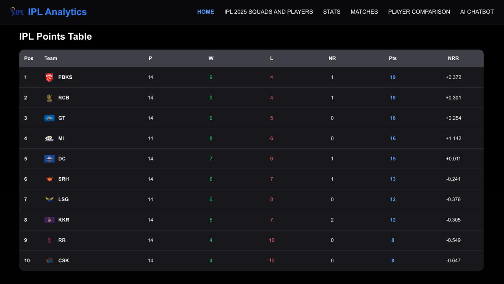
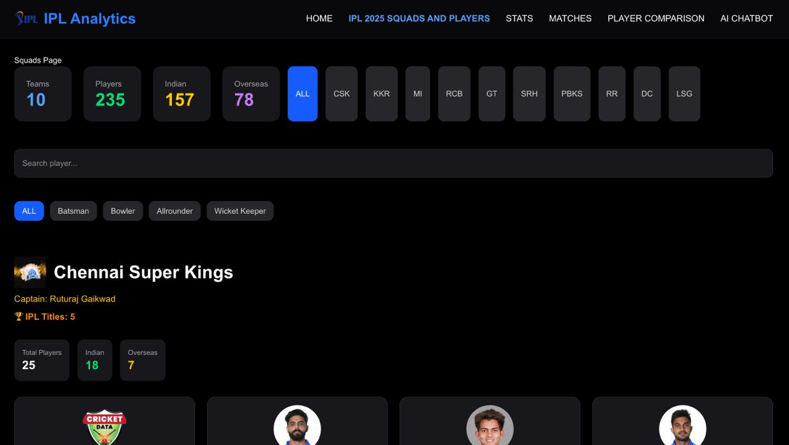
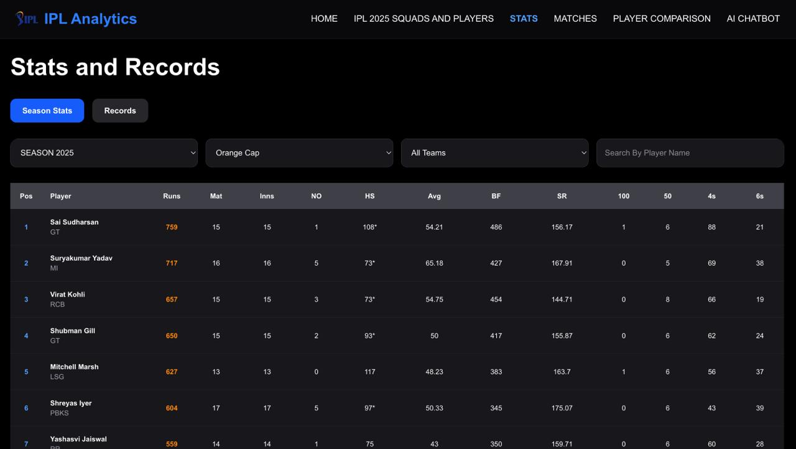
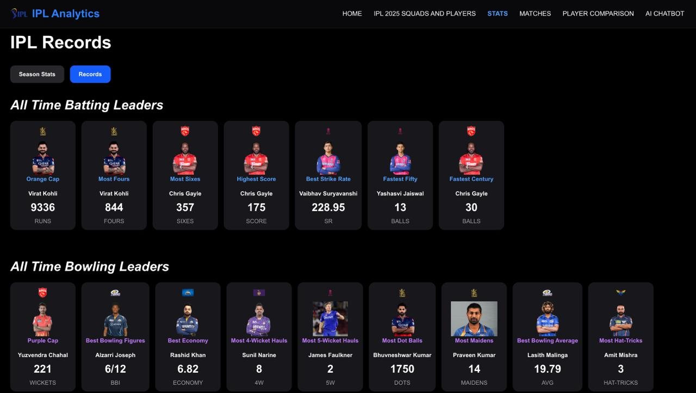
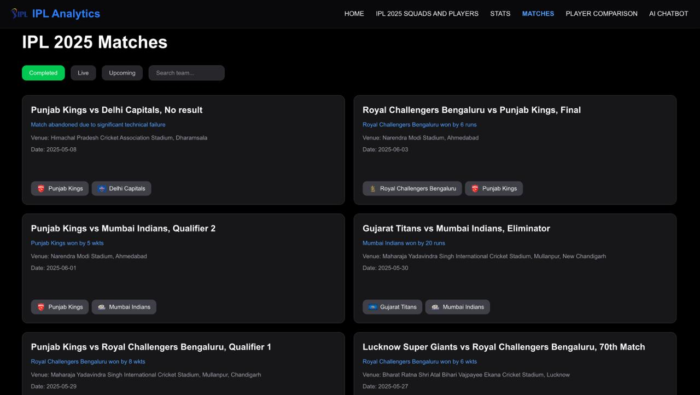
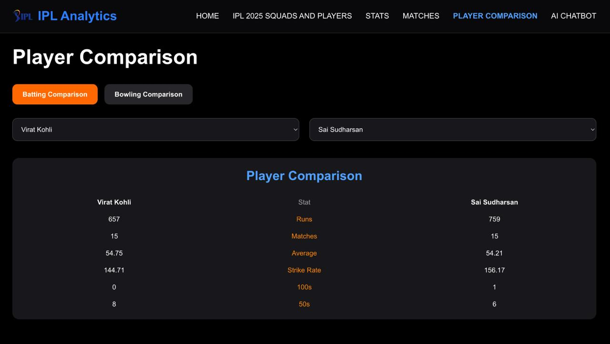

# 🏏 IPL Analytics

An interactive IPL Analytics platform built using **Next.js, TypeScript, Tailwind CSS, and FastAPI**. The project provides comprehensive insights into IPL 2025 through player statistics, team analysis, match results, records, awards, squads, player comparison, and an AI-powered chatbot.

---

## 🚀 Features

### 📊 Analytics Dashboard

* IPL 2025 Points Table
* Batting Statistics
* Bowling Statistics
* Team Performance Insights

### 👥 Teams & Squads

* Complete IPL 2025 Squads
* Team Logos
* Player Information
* Team-wise Squad View

### 🏆 Records & Awards

* Most Orange Caps
* Most Purple Caps
* Most IPL Titles
* Most MVP Awards
* Historic IPL Records
* Award Winners and Achievements

### 🏟️ Matches

* IPL 2025 Match Results
* Match Details Page
* Team Logos and Match Information
* Match Search Functionality
* Completed Match Tracking

### 🔍 Player Comparison

* Compare two IPL players side-by-side
* View batting statistics
* Analyze player performances
* Quick performance comparison

### 🤖 IPL Chatbot

* Answers IPL-related questions
* Uses project datasets for responses
* Provides information on:

  * Records
  * Awards
  * Squads
  * Player Statistics
  * Team Performance

---

## 🛠️ Tech Stack

### Frontend

* Next.js
* React
* TypeScript
* Tailwind CSS

### Backend

* FastAPI
* Python

### Deployment

* Vercel (Frontend)
* Render (Backend)

---

## 📂 Project Structure

```text
IPL-Analytics/
│
├── frontend/
│   ├── app/
│   │   ├── analytics/
│   │   ├── chatbot/
│   │   ├── compare/
│   │   ├── matches/
│   │   ├── players/
│   │   └── squads/
│   │
│   ├── components/
│   │
│   └── public/
│       ├── data/
│       ├── logos/
│       ├── players/
│       └── teams/
│
├── backend/
│   ├── main.py
│   ├── requirements.txt
│   ├── data.json
│   └── squads.json
│
└── README.md
```

---

## ⚙️ Installation

### Clone Repository

```bash
git clone https://github.com/azhaar1188/IPL-_Analytics.git
cd IPL-_Analytics
```

### Frontend Setup

```bash
cd frontend
npm install
npm run dev
```

Frontend runs on:

```text
http://localhost:3000
```

### Backend Setup

```bash
cd backend
pip install -r requirements.txt
uvicorn main:app --reload
```

Backend runs on:

```text
http://127.0.0.1:8000
```

---

## 🌐 Live Demo

### Frontend

https://ipl-analytics-lovat.vercel.app/

### Backend

https://ipl-analytics-aezg.onrender.com

---

## 📸 Screenshots

### Home Page



### Squads Page



### Stats



### Records



### Matches Page



### Player Comparison



---

## 📈 Data Covered

* IPL 2025 Points Table
* Batting Statistics
* Bowling Statistics
* Team Squads
* Match Results
* Awards & Records
* Historical IPL Achievements

---

## 🎯 Future Improvements

* Advanced AI-powered chatbot using LLMs
* Interactive data visualizations
* Multi-season IPL analysis
* Enhanced player comparison tools
* Live match integration
* Predictive analytics

---

## 👨‍💻 Author

**Mohammed Azhaar**

GitHub: https://github.com/azhaar1188

---

⭐ If you found this project useful, consider giving it a star on GitHub!
